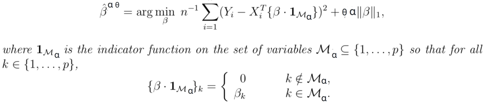
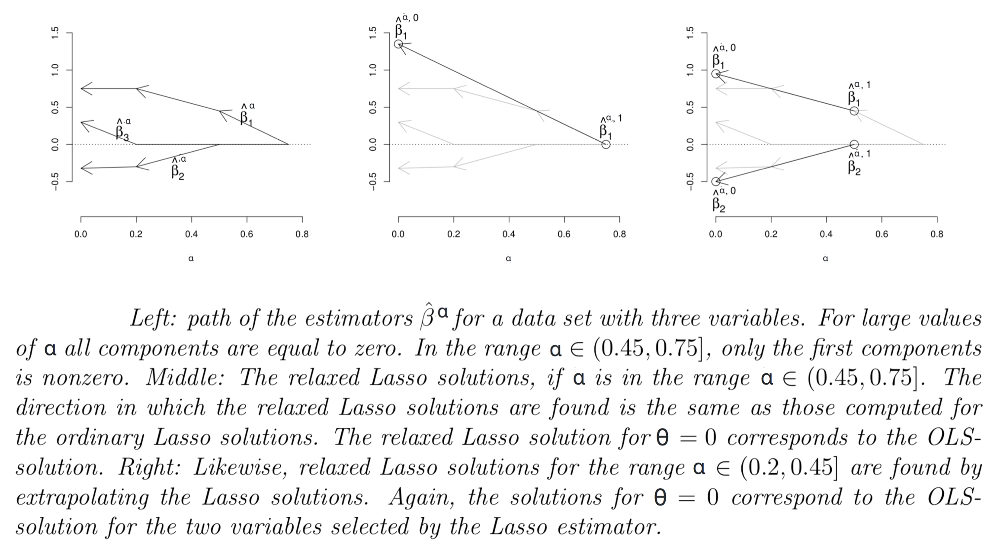

Introduction
=============

The Relaxed Lasso package is a Python implementation of the improved version of classical lasso regularization
for linear regression, as per the paper `Relaxed Lasso <https://stat.ethz.ch/~nicolai/relaxo.pdf>`_
by Nicholas Meinshausen (2007), in the style of scikit-learn.

For more information about Relaxed Lasso, see below.

What is relaxed lasso, when is it used ?
****************************************

Lasso, and its improvement Relaxed Lasso, are extensions of linear regressions.
The main benefits are their ability to deal with colinearity, high dimensions
(even higher than number of samples) and the fact that they lead to a sparse
solutions.

According to Hastie, Tibshirani (2016) in `Best Subset, Forward Stepwise, or
Lasso <https://www.stat.cmu.edu/~ryantibs/papers/bestsubset.pdf>`_, relaxed lasso
is the overall winner when it comes to variables selection.

Surprisingly up to now there was no Python implementation of this
algorithm, although one exists in R (`relaxo <https://cran.r-project.org/web/packages/relaxo/index.html>`_).

Relaxed Lasso concept
**********************

The current work is motivated by linear prediction for high dimensional data,
where the number of predictor variables p is very large, possibly very much
larger than the number of observations n.
Regularization is clearly of central importance for these high dimensional problems.

The key concept is that there are two regularization parameters, α ∈ [0, ∞) which
controls the variables that will be retained in the model, and θ ∈ (0, 1]
which acts as a multiplicative factor of α to choose the
amount of regularization applied to the subset of variables.

The relaxed Lasso estimator is defined for α ∈ [0, ∞) and θ ∈ (0, 1] as :

Note that :

- θ = 1 corresponds to standard Lasso.
- θ = 0 corresponds to the Ordinary Least Square solution for the subset of
  variables selected with α.

Implementation
==============

The implementation in the class RelaxedLassoLars uses Least-angle regression (LARS)
as the algorithm to fit the coefficients.

Algorithm
*********

The main advantage of the relaxed Lasso estimator over Bridge estimation is
the low computational complexity.

Basically, the Relaxed Lasso solution is equivalent to computing 2 steps of Lasso
in a row. The first stage being for the variable selection as in ordinary Lasso estimation,
and the second one for the shrinkage of coefficients.

It is shown in the paper that for many data sets, the computational effort of computing
all relaxed Lasso solutions is identical to that of solving the ordinary Lasso solutions.
Because the “direction” in which relaxed Lasso solutions are found is identical to the
directions of ordinary Lasso solutions. These directions do not have to be computed again.

Indeed, by extrapolating the path of the ordinary Lasso solutions, all relaxed Lasso
solutions can often be found. So we used the refined version of this algorithm instead.

Experiment results
******************

We generated datasets where the number of predictors is much larger than the number of 
observations as per Wang et al. (2010) in *Variable selection via combined penalization 
for high-dimensional data analysis*.

More specifically, the dataset consists of 1000 variables and 50 rows, with high 
colineraity between columns. The colinerarity between columns respectively with 
index *i* and *j* is defined by the formula :math:`0.5^{i-j}`. For instance two contiguous 
columns have a colinearity of value 0.5

The output is a linear combination of only 6 variables, with added gaussian noise of 
standard deviation 2.

+-----------------+-------------------+
| Variable number | Coefficient value |
+=================+===================+
| 0               | 7                 |
+-----------------+-------------------+
| 10              | 5                 |
+-----------------+-------------------+
| 20              | 3                 |
+-----------------+-------------------+
| 30              | 1                 |
+-----------------+-------------------+
| 40              | 0.5               |
+-----------------+-------------------+
| 50              | 0.2               |
+-----------------+-------------------+

Here are the results of running lasso and relaxed lasso on 100 such datasets:

+-------------+----------------------------------+-------------------------+
|             |Avg. number of variables retained | Avg. Mean Squared Error |
+=============+==================================+=========================+
|Lasso        |23.62                             |9.13                     |
+-------------+----------------------------------+-------------------------+
|Relaxed Lasso|4.08                              |7.11                     |
+-------------+----------------------------------+-------------------------+

In such a setting it shows a clear superiority of relaxed lasso which leads to sparser, better fitting model.

Example gallery
===============

An example of the ``RelaxedLassoLars`` class :
::
	
  from relaxed_lasso import RelaxedLassoLars
  from sklearn.datasets import make_regression

  X, y, true_coefs = make_regression(n_samples=50,
                                     n_features=1000,
                                     n_informative=5,
                                     noise=4.0,
                                     random_state=0,
                                     coef=True)

  relasso = RelaxedLassoLars()
  relasso.fit(X, y)
  relasso.predict(X)

An example of the ``RelaxedLassoLarsCV`` class :
::

  from relaxed_lasso import RelaxedLassoLarsCV
  from sklearn.datasets import make_regression

  X, y, true_coefs = make_regression(n_samples=100,
                                     n_features=1000,
                                     n_informative=5,
                                     noise=4.0,
                                     random_state=0,
                                     coef=True)

  relassoCV = RelaxedLassoLarsCV(cv=3) # 5 folds by default 
  relassoCV.fit(X, y)

  print("R-squared: ", relassoCV.score(X, y))

  # Best parameters
  print("Best Alpha: ", relassoCV.alpha_)
  print("Best Theta: ", relassoCV.theta_)
  relasso.predict(X)
